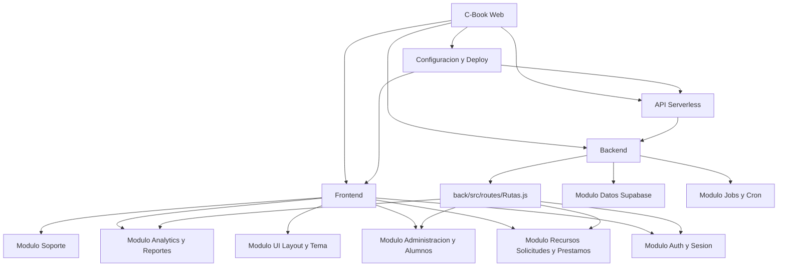

# Grafo de relaciones - C-Book Web

Nodo central para navegar el proyecto por relaciones.

## Nodos principales

- [[Arquitectura General C-Book]]
- [[Frontend]]
- [[Backend]]
- [[API Serverless]]
- [[Configuracion y Deploy]]
- [[Modulo Auth y Sesion]]
- [[Modulo Recursos Solicitudes y Prestamos]]
- [[Modulo Administracion y Alumnos]]
- [[Modulo Analytics y Reportes]]
- [[Modulo Soporte]]
- [[Modulo UI Layout y Tema]]
- [[Modulo Datos Supabase]]
- [[Modulo Jobs y Cron]]
- [[Modulo Tests]]

## Relacion general

## Mapa original

- [[00 - Mapa completo C-Book Web]]
