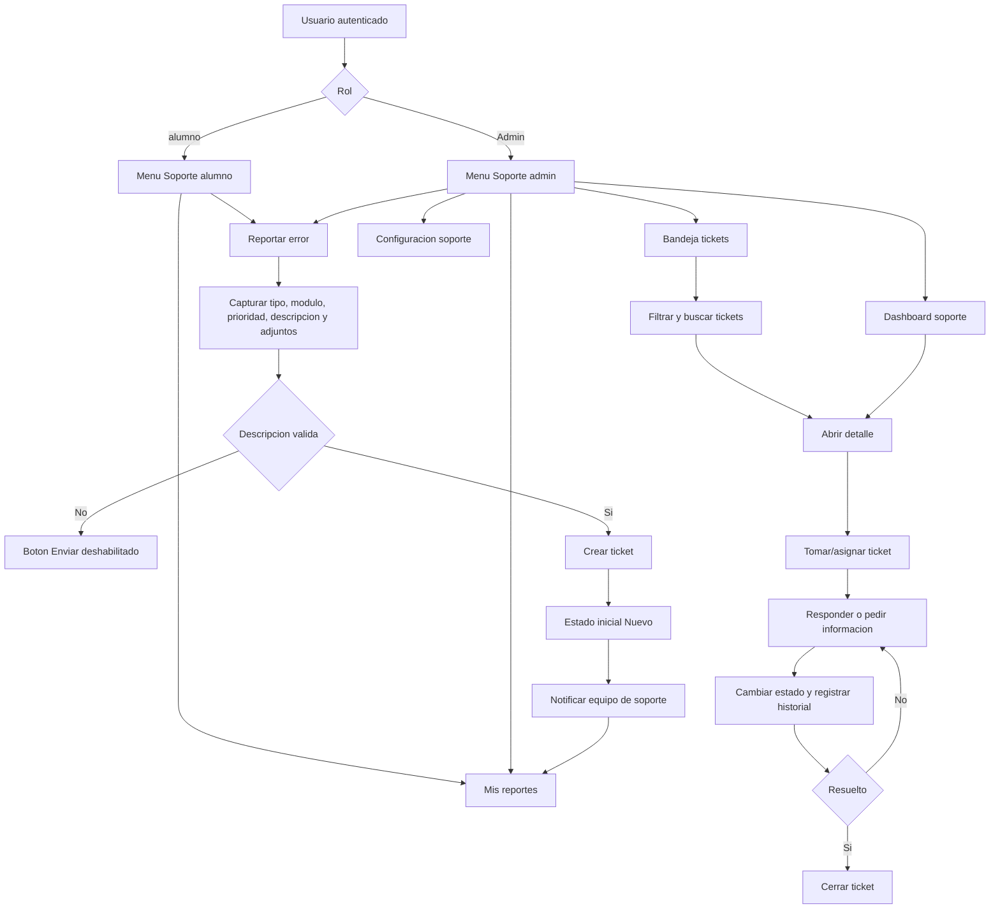
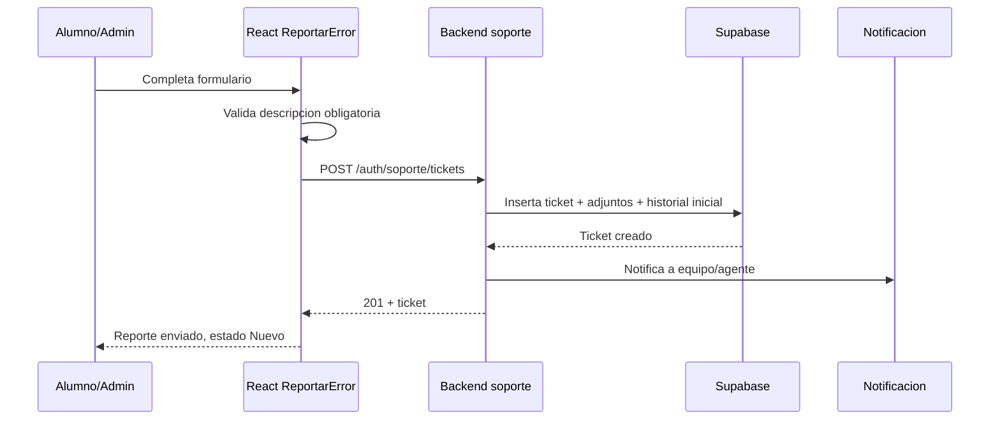
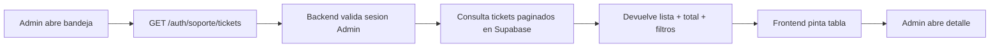
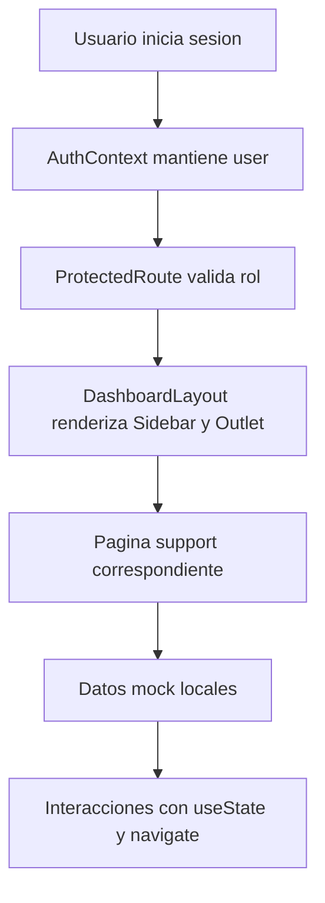
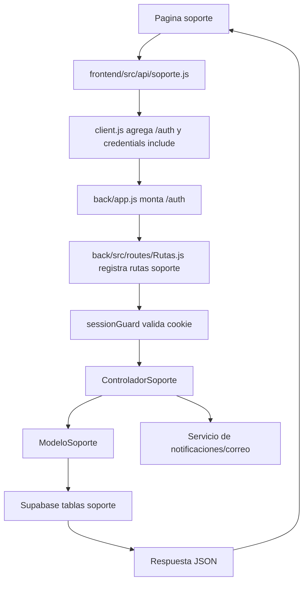

# Flujo - Modulo Soporte

## Resumen ejecutivo

El modulo de soporte permite que alumnos y administradores reporten errores del sistema y que el administrador de soporte visualice, filtre, atienda y configure la operacion de tickets.

En el codigo actual el flujo esta representado principalmente en frontend con datos mock. Las rutas UI existen y estan protegidas por rol, pero no hay endpoints de soporte registrados en `back/src/routes/Rutas.js`; ademas `back/src/controllers/ControladorSoporte.js` existe vacio. Por eso, el flujo documentado se divide en:

- **Flujo implementado actual:** navegacion, formularios, filtros, tableros y pantallas visuales.
- **Flujo funcional esperado:** persistencia de tickets, notificaciones, asignacion, seguimiento, respuesta y cierre.

## Actores

| Actor | Rol en el sistema | Participacion en soporte |
|---|---|---|
| Alumno | `alumno` | Reporta errores y consulta sus reportes. |
| Administrador | `Admin` | Reporta errores, consulta sus reportes y atiende tickets. |
| Agente de soporte | Derivado del rol admin en UI | Toma tickets, responde, cambia estados, registra tiempo y cierra reportes. |
| Sistema | Frontend + backend + base de datos | Debe crear tickets, guardar historial, notificar y calcular metricas. |

## Requerimientos funcionales inferidos

Estos RF salen de las etiquetas visibles y de las capacidades de las pantallas del modulo.

| RF | Requerimiento funcional | Evidencia en UI | Estado actual |
|---|---|---|---|
| RF-01 | Permitir reportar un error indicando tipo de incidencia. | `ReportarError.jsx` muestra tipos: Funcional, Visual, Rendimiento, Datos, Acceso y Otro. | UI mock |
| RF-02 | Permitir indicar ubicacion/modulo, prioridad, descripcion y adjuntos. | `ReportarError.jsx` contiene selector de modulo, prioridad, textarea y dropzone. | UI mock |
| RF-03 | Crear el ticket con estado inicial `Nuevo` y notificar al equipo. | Panel "Que pasa al enviar" y confirmacion "Reporte enviado". | Solo mensaje visual |
| RF-04 | Permitir al admin consultar y filtrar tickets. | `BandejaTickets.jsx` filtra por estado, tipo, prioridad y busqueda. | UI mock |
| RF-05 | Permitir consultar el detalle completo del ticket. | `DetalleTicket.jsx` muestra descripcion, pasos, adjuntos, historial y datos laterales. | UI mock |
| RF-06 | Permitir tomar/asignar/reasignar ticket. | Botones "Tomar ticket" y "Reasignar" en detalle. | UI mock |
| RF-07 | Permitir cambiar estado: Nuevo, Abierto, Pendiente, En espera, Resuelto, Cerrado. | Badges y acciones de estado en bandeja/detalle. | UI mock |
| RF-08 | Permitir responder al solicitante y agregar notas internas. | Compositor con pestañas "comentario" y "nota interna". | UI mock |
| RF-09 | Registrar historial cronologico del ticket. | Timeline en `DetalleTicket.jsx`. | UI mock |
| RF-10 | Registrar tiempo de atencion/SLA. | Cronometro, tiempo registrado y barra SLA en detalle. | UI mock |
| RF-11 | Administrar tipos de incidencia. | Configuracion, tab `CU-S11`. | UI mock |
| RF-12 | Administrar agentes de soporte. | Configuracion, tab `CU-S12`. | UI mock |
| RF-13 | Configurar distribucion automatica. | Configuracion, tab `CU-S13`. | UI mock |
| RF-14 | Administrar plantillas de respuesta. | Configuracion, tab `CU-S14`. | UI mock |

## Casos de uso

| CU | Nombre | Actor principal | Ruta UI | Objetivo |
|---|---|---|---|---|
| CU-S01 | Reportar error | Alumno/Admin | `/user/soporte/reportar`, `/admin/soporte/reportar` | Capturar la incidencia y crear un ticket. |
| CU-S02 | Ver dashboard de soporte | Admin | `/admin/soporte` | Consultar indicadores, cola viva, carga de agentes y distribucion por tipo. |
| CU-S03 | Consultar bandeja de tickets | Admin | `/admin/soporte/tickets` | Buscar, filtrar y abrir tickets. |
| CU-S04 | Ver detalle de ticket | Admin | `/admin/soporte/tickets/:id` | Revisar descripcion, historial, adjuntos, SLA y acciones. |
| CU-S05 | Atender ticket | Admin/Agente | `/admin/soporte/tickets/:id` | Tomar, cambiar estado, responder, registrar tiempo y resolver. |
| CU-S06 | Consultar mis reportes | Alumno/Admin | `/user/soporte/mis-reportes`, `/admin/soporte/mis-reportes` | Dar seguimiento a reportes creados por el usuario. |
| CU-S11 | Configurar tipos | Admin | `/admin/soporte/config` | Crear, editar, activar o desactivar categorias. |
| CU-S12 | Configurar agentes | Admin | `/admin/soporte/config` | Gestionar agentes, rol, estado y carga. |
| CU-S13 | Configurar distribucion | Admin | `/admin/soporte/config` | Definir estrategia de asignacion y reglas. |
| CU-S14 | Configurar plantillas | Admin | `/admin/soporte/config` | Crear y editar respuestas predefinidas. |

## Flujo general del modulo

## Flujo CU-S01 - Reportar error

1. El usuario entra desde el menu lateral:
   - Alumno: `/user/soporte/reportar`.
   - Admin: `/admin/soporte/reportar`.
2. `ProtectedRoute` valida que exista sesion y que el rol corresponda a la zona (`alumno` o `Admin`).
3. `DashboardLayout` carga la pantalla `ReportarError.jsx`.
4. El usuario selecciona tipo de error:
   - Funcional.
   - Visual.
   - Rendimiento.
   - Datos.
   - Acceso.
   - Otro.
5. El usuario indica donde ocurrio el problema:
   - Prestamos - Nuevo prestamo.
   - Catalogo - Busqueda.
   - Usuarios - Registro.
   - Reportes - Exportar.
   - Otro modulo.
6. El usuario selecciona prioridad sugerida:
   - Baja: puede seguir trabajando.
   - Media: afecta una tarea.
   - Alta: bloquea operacion de biblioteca.
7. El usuario escribe una descripcion obligatoria. Si esta vacia, `Enviar reporte` queda deshabilitado.
8. El usuario puede adjuntar evidencia, pero hoy los adjuntos son mock; no hay carga real.
9. Al presionar enviar:
   - Flujo actual: `handleEnviar()` solo cambia `enviado` a `true` y regresa a la pantalla anterior despues de 2.5 segundos.
   - Flujo esperado: frontend debe llamar a un endpoint backend, el backend debe insertar el ticket, generar ID `SOP-####`, guardar adjuntos, crear historial inicial y notificar al equipo.

## Flujo CU-S02 - Dashboard de soporte

1. El admin entra a `/admin/soporte`.
2. `SoporteDashboard.jsx` muestra indicadores operativos:
   - Total tickets.
   - Abiertos.
   - Pendientes.
   - Resueltos del mes.
   - Tiempo medio.
3. Muestra graficas:
   - Tickets creados vs resueltos.
   - Distribucion por tipo.
4. Muestra cola viva de tickets que requieren atencion.
5. Muestra carga de agentes.
6. Desde la cola viva, el admin puede abrir el detalle de un ticket.

Estado actual: todos los datos vienen de constantes mock (`MOCK_TICKETS`, `CHART_DATA`, `TIPO_DATA`, `AGENTS`, `STATS`). No existe llamada a API.

## Flujo CU-S03 - Bandeja de tickets

1. El admin entra a `/admin/soporte/tickets`.
2. `BandejaTickets.jsx` carga una tabla con tickets mock.
3. El admin puede filtrar por:
   - Estado.
   - Tipo.
   - Prioridad.
   - Texto: ID, titulo o solicitante.
4. Al seleccionar un ticket, navega a `/admin/soporte/tickets/:id`.
5. La tabla tambien muestra solicitante, agente asignado, SLA, tiempo y ultima actualizacion.

Flujo esperado con backend:

## Flujo CU-S04/CU-S05 - Detalle y atencion de ticket

1. El admin abre `/admin/soporte/tickets/:id`.
2. `DetalleTicket.jsx` obtiene el `id` desde `useParams()`.
3. Flujo actual:
   - Busca el ticket en `MOCK_TICKETS`.
   - Si no encuentra el ID, usa `SOP-2841` como fallback.
4. La pantalla muestra:
   - Encabezado: ID, estado, tipo, prioridad y ultima actualizacion.
   - Solicitante, rol, fecha de creacion y tiempo registrado.
   - Descripcion y pasos para reproducir.
   - Adjuntos.
   - Historial cronologico.
   - Compositor de comentario o nota interna.
   - Panel lateral con detalles, SLA, cronometro, atajos y tickets relacionados.
5. Acciones esperadas:
   - Tomar ticket: asignar al agente actual y cambiar a `Abierto`.
   - Cambiar estado: mover entre `Nuevo`, `Abierto`, `Pendiente`, `En espera`, `Resuelto`, `Cerrado`.
   - Resolver: marcar como `Resuelto` y notificar al solicitante.
   - Reasignar: cambiar agente responsable.
   - Registrar tiempo: guardar duracion de trabajo.
   - Cerrar: finalizar el caso.
   - Reabrir: devolver el ticket a atencion si el problema persiste.
   - Enviar respuesta: agregar mensaje visible para el solicitante.
   - Nota interna: agregar entrada solo visible para soporte.

## Flujo CU-S06 - Mis reportes

1. Alumno o admin entra a:
   - `/user/soporte/mis-reportes`.
   - `/admin/soporte/mis-reportes`.
2. `MisReportes.jsx` muestra tickets creados por el usuario.
3. Permite buscar por ID o titulo.
4. Permite filtrar por estado.
5. Permite crear nuevo reporte desde el boton `Nuevo reporte`.
6. Al seleccionar un reporte, hoy navega a `/admin/soporte/tickets/:id`.

Observacion importante: para alumnos, esa navegacion apunta a una ruta de admin. Como la ruta de detalle solo esta declarada bajo `/admin/soporte/tickets/:id`, un alumno podria ser bloqueado por `ProtectedRoute role="Admin"`. Para cerrar el flujo de alumno, conviene crear una ruta de detalle propia en `/user/soporte/mis-reportes/:id` o una pantalla de detalle compartida protegida por permisos.

## Flujo CU-S11 a CU-S14 - Configuracion de soporte

La pantalla `/admin/soporte/config` agrupa cuatro configuraciones:

| Tab | Caso de uso | Funcion |
|---|---|---|
| Tipos de incidencia | CU-S11 | Crear, editar, activar/desactivar y eliminar categorias. |
| Agentes | CU-S12 | Invitar o gestionar agentes, rol, estado y carga. |
| Distribucion | CU-S13 | Activar asignacion automatica, elegir estrategia balanceada/secuencial y reglas. |
| Plantillas | CU-S14 | Crear, editar, duplicar y borrar respuestas predefinidas. |

Estado actual: cambios locales de UI con `useState`; no se guardan en backend ni base de datos.

## Estados del ticket

| Estado | Significado | Transicion esperada |
|---|---|---|
| Nuevo | Ticket creado sin agente asignado. | Se asigna o se toma. |
| Abierto | Agente ya atiende el caso. | Puede pasar a Pendiente, En espera, Resuelto o Cerrado. |
| Pendiente | Soporte necesita informacion o una accion externa. | Vuelve a Abierto cuando hay respuesta. |
| En espera | Bloqueado por dependencia o validacion. | Vuelve a Abierto o pasa a Resuelto. |
| Resuelto | Soporte indica que el problema fue solucionado. | Puede cerrarse o reabrirse. |
| Cerrado | Caso finalizado. | Puede reabrirse si el problema continua. |

## Modelo de datos sugerido

Como el backend aun no esta conectado, estas tablas son una propuesta minima para completar el flujo funcional.

### `soporte_tickets`

| Campo | Tipo sugerido | Uso |
|---|---|---|
| `id` | uuid/int | Identificador interno. |
| `folio` | text | Folio visible tipo `SOP-2841`. |
| `creado_por_boleta` | text | Usuario que reporta. |
| `creado_por_rol` | text | `alumno` o `Admin`. |
| `tipo` | text | Funcional, Visual, Rendimiento, Datos, Acceso, Otro. |
| `modulo` | text | Area donde ocurrio. |
| `prioridad` | text | Baja, Media, Alta. |
| `titulo` | text | Asunto corto. |
| `descripcion` | text | Detalle del problema. |
| `estado` | text/int | Estado actual. |
| `agente_boleta` | text/null | Responsable actual. |
| `fecha_creacion` | timestamp | Alta del ticket. |
| `fecha_actualizacion` | timestamp | Ultimo cambio. |
| `fecha_resolucion` | timestamp/null | Cuando se resolvio. |
| `sla_limite` | timestamp/null | Fecha/hora limite. |

### `soporte_historial`

| Campo | Uso |
|---|---|
| `ticket_id` | Relacion con ticket. |
| `actor_boleta` | Quien realizo la accion. |
| `tipo_evento` | created, taken, status, comment, internal_note, time, attachment. |
| `mensaje` | Texto visible o descripcion del cambio. |
| `visible_solicitante` | Diferencia comentario publico vs nota interna. |
| `created_at` | Fecha del evento. |

### `soporte_adjuntos`

| Campo | Uso |
|---|---|
| `ticket_id` | Relacion con ticket. |
| `nombre_archivo` | Nombre original. |
| `mime_type` | Tipo de archivo. |
| `size_bytes` | Tamano. |
| `storage_path` | Ruta en Supabase Storage u otro storage. |
| `uploaded_by` | Usuario que subio el archivo. |

### `soporte_config_*`

Tablas sugeridas:

- `soporte_tipos_incidencia`.
- `soporte_agentes`.
- `soporte_reglas_distribucion`.
- `soporte_plantillas`.

## Endpoints backend sugeridos

Todos bajo `/auth`, siguiendo el patron actual de `frontend/src/api/client.js`.

| Metodo | Endpoint | Actor | Funcion |
|---|---|---|---|
| POST | `/auth/soporte/tickets` | Alumno/Admin | Crear ticket. |
| GET | `/auth/soporte/mis-reportes` | Alumno/Admin | Listar reportes del usuario autenticado. |
| GET | `/auth/soporte/tickets` | Admin | Listar tickets con filtros y paginacion. |
| GET | `/auth/soporte/tickets/:id` | Admin o solicitante | Consultar detalle. |
| POST | `/auth/soporte/tickets/:id/tomar` | Admin | Tomar/asignar ticket. |
| PATCH | `/auth/soporte/tickets/:id/estado` | Admin | Cambiar estado. |
| POST | `/auth/soporte/tickets/:id/comentarios` | Admin o solicitante | Agregar respuesta/comentario. |
| POST | `/auth/soporte/tickets/:id/notas` | Admin | Agregar nota interna. |
| POST | `/auth/soporte/tickets/:id/tiempo` | Admin | Registrar tiempo. |
| POST | `/auth/soporte/tickets/:id/adjuntos` | Alumno/Admin | Subir evidencia. |
| GET | `/auth/soporte/dashboard` | Admin | Obtener metricas y cola viva. |
| GET/POST/PATCH/DELETE | `/auth/soporte/config/*` | Admin | Gestionar configuracion. |

## Brechas detectadas en el codigo actual

1. `back/src/controllers/ControladorSoporte.js` esta vacio.
2. `back/src/routes/Rutas.js` no registra endpoints de soporte.
3. No existe wrapper `frontend/src/api/soporte.js`.
4. Las pantallas usan constantes mock y no hacen llamadas a backend.
5. Los adjuntos no se cargan realmente.
6. `MisReportes.jsx` navega a `/admin/soporte/tickets/:id`, lo cual no cierra bien el flujo de alumno.
7. No hay persistencia de tickets, historial, comentarios, agentes, SLA ni configuracion.
8. No se detecto integracion real con ChatGPT/OpenAI dentro del modulo de soporte. Si el requerimiento incluye asistencia por ChatGPT, falta definir endpoint, prompt, permisos, auditoria y almacenamiento de respuestas sugeridas.

## Archivos principales

| Capa | Archivo | Responsabilidad |
|---|---|---|
| Rutas frontend | `frontend/src/App.jsx` | Declara rutas de soporte para alumno y admin. |
| Navegacion | `frontend/src/components/layout/Sidebar.jsx` | Muestra menu Soporte segun rol. |
| Reporte | `frontend/src/pages/support/ReportarError.jsx` | Formulario CU-S01. |
| Mis reportes | `frontend/src/pages/support/MisReportes.jsx` | Seguimiento del usuario. |
| Dashboard | `frontend/src/pages/support/SoporteDashboard.jsx` | Indicadores y cola viva. |
| Bandeja | `frontend/src/pages/support/BandejaTickets.jsx` | Listado y filtros. |
| Detalle | `frontend/src/pages/support/DetalleTicket.jsx` | Atencion y seguimiento del ticket. |
| Configuracion | `frontend/src/pages/support/ConfiguracionSoporte.jsx` | Tipos, agentes, distribucion y plantillas. |
| Estilos | `frontend/src/styles/support.css` | Estilos del modulo. |
| Backend | `back/src/controllers/ControladorSoporte.js` | Existe, pero esta vacio. |
| Rutas backend | `back/src/routes/Rutas.js` | No registra rutas de soporte actualmente. |

## Flujo tecnico actual

## Flujo tecnico requerido para produccion

## Criterio de terminado del modulo

El modulo de soporte puede considerarse completo cuando:

1. Crear reporte persiste un ticket real y devuelve folio.
2. Mis reportes muestra solo tickets del usuario autenticado.
3. Bandeja admin lista tickets reales con filtros, paginacion y busqueda.
4. Detalle carga por ID real, sin fallback mock.
5. Acciones de atencion actualizan estado, agente, historial y tiempo.
6. Comentarios y notas se guardan con visibilidad correcta.
7. Adjuntos se suben y se pueden consultar.
8. Dashboard consume metricas reales.
9. Configuracion guarda tipos, agentes, reglas y plantillas.
10. Alumno tiene un detalle propio o compartido con permisos correctos.
11. El backend valida permisos: alumno solo ve sus tickets; admin ve y gestiona todos.
12. Las notificaciones se envian al crear, pedir informacion, resolver, cerrar o reabrir ticket.

