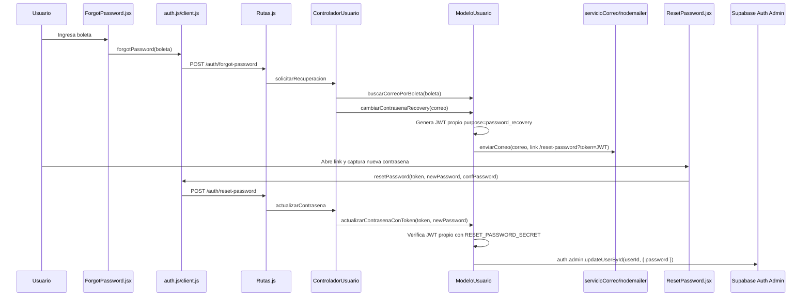

---
tipo: nodo-modulo
proyecto: C-Book Web
---

# Modulo Auth y Sesion

## Relacionado con

- [[00 - Grafo C-Book Web]]
- [[Arquitectura General C-Book]]
- [[Frontend]]
- [[Backend]]

## Flujo

[[Archivo - frontend - src - context - AuthContext.jsx]] -> [[Archivo - frontend - src - api - auth.js]] -> [[Archivo - frontend - src - api - client.js]] -> /auth/* -> [[Archivo - back - src - routes - Rutas.js]] -> [[Archivo - back - src - controllers - ControladorUsuario.js]].

## Flujo de recuperacion de contrasena

El flujo actual no usa el correo nativo de recuperacion de Supabase Auth (`resetPasswordForEmail`). Usa un flujo propio del backend y solo al final actualiza la contrasena en Supabase Auth con permisos admin.

Puntos clave:

- `ForgotPassword.jsx` solo pide boleta; no pide correo.
- `ControladorUsuario.solicitarRecuperacion` busca el correo con `buscarCorreoPorBoleta`.
- `ModeloUsuario.cambiarContrasenaRecovery` genera un JWT propio de 30 minutos y manda el correo con `servicioCorreo.js`.
- `ResetPassword.jsx` lee `token` desde query string, no desde una sesion de recovery de Supabase.
- `ModeloUsuario.actualizarContrasenaConToken` valida el JWT propio y cambia la contrasena con `supabase.auth.admin.updateUserById`.
- `frontend/src/lib/supabaseClient.js` no participa directamente en este flujo.

## Archivos conectados

- [[Archivo - frontend - src - context - AuthContext.jsx]]
- [[Archivo - frontend - src - pages - Login.jsx]]
- [[Archivo - frontend - src - pages - ForgotPassword.jsx]]
- [[Archivo - frontend - src - pages - EmailVerification.jsx]]
- [[Archivo - frontend - src - pages - ResetPassword.jsx]]
- [[Archivo - frontend - src - api - auth.js]]
- [[Archivo - frontend - src - components - layout - ProtectedRoute.jsx]]
- [[Archivo - back - src - middleware - sessionGuard.js]]
- [[Archivo - back - src - middleware - validacionUsuario.js]]
- [[Archivo - back - src - models - ModeloUsuario.js]]
- [[Archivo - back - src - controllers - ControladorUsuario.js]]`r`n- [[Archivo - back - src - utils - servicioCorreo.js]]

