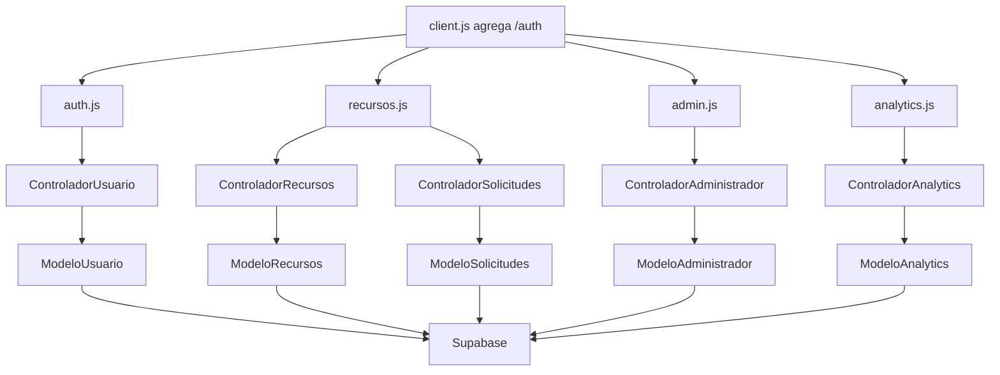
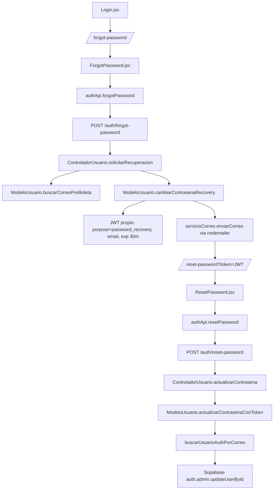

---
tipo: nodo-api
proyecto: C-Book Web
---

# Relaciones API Backend

## Nodos

- [[Backend]]
- [[Archivo - back - app.js]]
- [[Archivo - back - src - routes - Rutas.js]]
- [[Archivo - frontend - src - api - client.js]]
- [[Archivo - frontend - src - api - auth.js]]
- [[Archivo - frontend - src - api - recursos.js]]
- [[Archivo - frontend - src - api - admin.js]]
- [[Archivo - frontend - src - api - analytics.js]]

## Flujo de endpoints

## Flujo especifico: recuperacion de contrasena

Notas:

- No se usa `supabase.auth.resetPasswordForEmail` ni el email template nativo de Supabase para este flujo.
- Supabase Auth si almacena la credencial final; el cambio se hace desde backend con `auth.admin.updateUserById`.
- El secreto del token propio sale de `RESET_PASSWORD_SECRET`; si no existe, cae a `SESSION_SECRET`.
